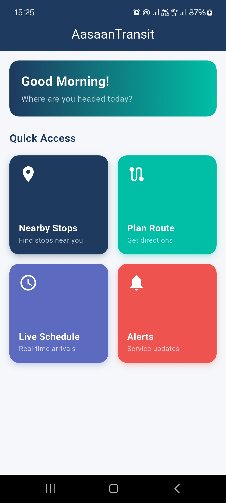
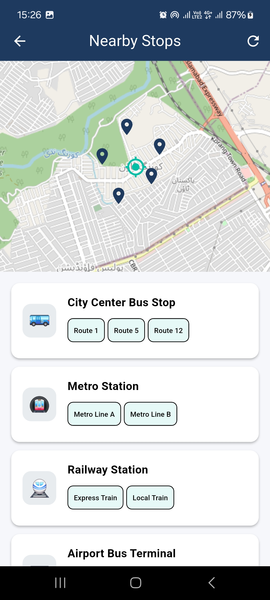
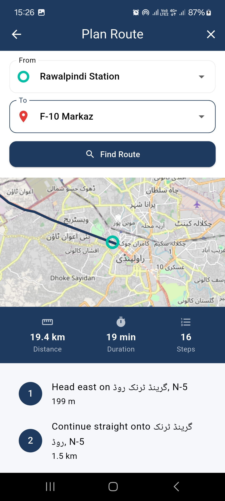
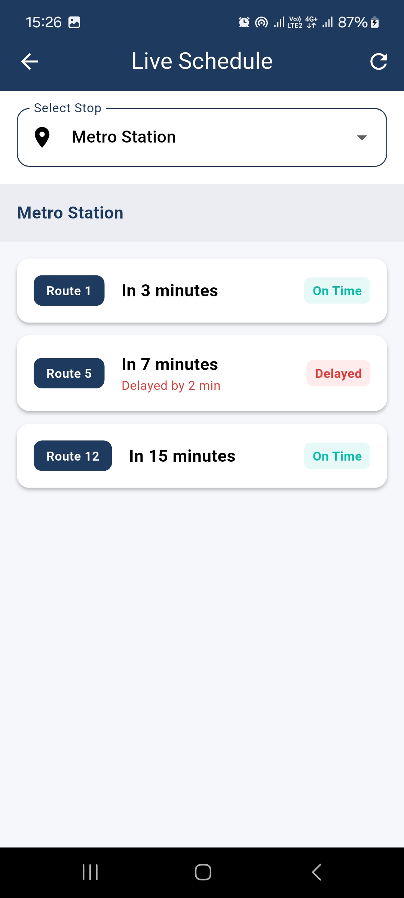
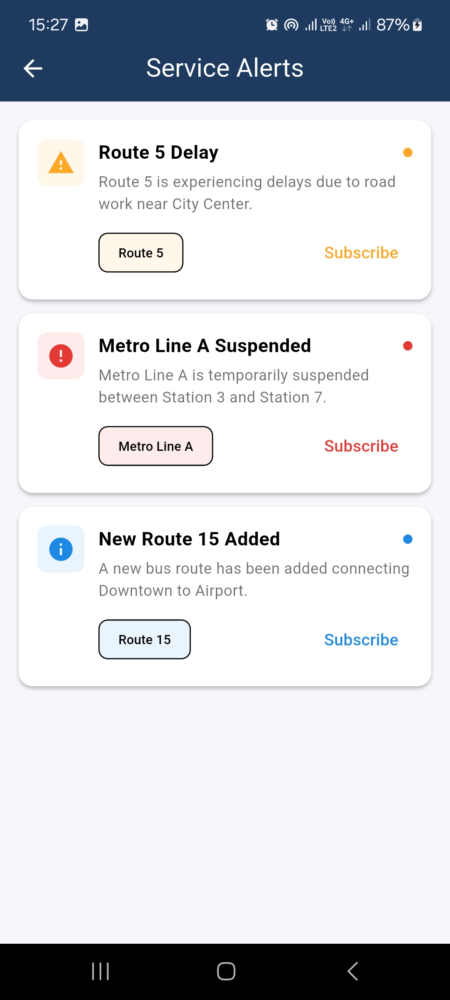

# AasaanTransit 🚌

A Flutter-based public transportation companion app that helps
commuters navigate public transportation systems efficiently.

## Features

- **Nearby Stops** — Detects user location and displays nearby
  transit stops on an interactive map
- **Route Planning** — Plan routes between locations with
  step-by-step navigation instructions
- **Live Schedule** — Real-time arrival times and delay status
  for transit stops
- **Service Alerts** — Stay updated with service disruptions
  and subscribe to specific transit lines

## Architecture

Built using **BLoC (Business Logic Component)** pattern:
```
Event → BLoC → State → UI
```

- `presentation/blocs/` — BLoC files for each feature
- `data/repositories/` — Data layer
- `data/models/` — Data models
- `core/services/` — Location and notification services

## Tech Stack

| Technology | Usage |
|------------|-------|
| Flutter | Cross-platform mobile framework |
| flutter_bloc | State management |
| flutter_map | OpenStreetMap integration |
| OpenRouteService API | Route planning and directions |
| Firebase FCM | Push notifications |
| Geolocator | GPS location services |

## Setup Instructions

### Prerequisites
- Flutter SDK 3.0+
- Android Studio / VS Code
- Firebase account
- OpenRouteService API key

### Installation

1. Clone the repository
```bash
   git clone https://github.com/YOUR_USERNAME/aasaan-transit.git
   cd aasaan-transit
```

2. Install dependencies
```bash
   flutter pub get
```

3. Create `.env` file in project root
```
   ORS_API_KEY=your_openrouteservice_api_key
```

4. Add `google-services.json` in `android/app/`

5. Run the app
```bash
   flutter run
```

## Note on Transit Data

Real-time transit data API is not publicly available for
Pakistan. Mock data has been used to simulate the functionality.
The architecture is designed to easily replace mock data with
a real API when available.

## Screenshots

| Home | Nearby Stops | Route Planning |
|------|-------------|----------------|
|  |  |  |

| Live Schedule | Service Alerts |
|--------------|----------------|
|  |  |

## Project Structure
```
lib/
├── main.dart
├── app.dart
├── config/          # App configuration
├── core/            # Services and utilities
├── data/            # Models and repositories
└── presentation/    # BLoC, screens, widgets
```